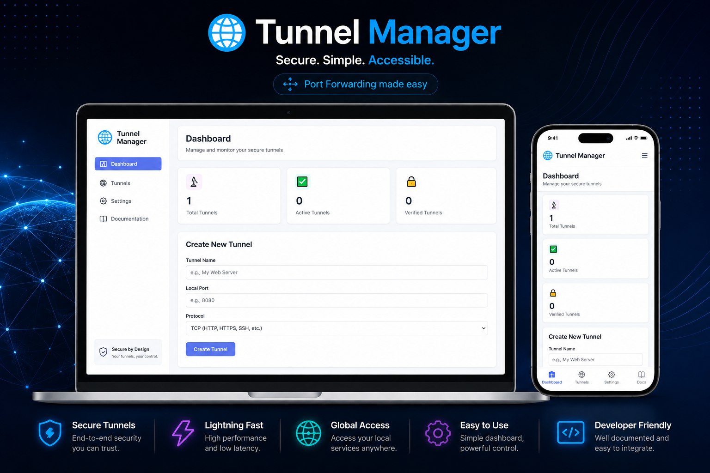

# Tunnel Manager

[](https://www.python.org/)
[](https://flask.palletsprojects.com/)
[](https://sqlite.org/)
[](https://socket.io/)

## Overview

Tunnel Manager is a Python-based tunnel management system for exposing Windows-local services to the public internet. It supports TCP, UDP, and combined proxying, while providing a secure verification process, Windows client generation, and a modern dashboard UI.

## Key Features

- ✅ Create and manage tunnels from a web dashboard
- ✅ Support for TCP, UDP, and BOTH protocol forwarding
- ✅ Windows client generation as `.bat` launcher files
- ✅ Verification workflow before tunnel activation
- ✅ Raw traffic forwarding for HTTP, HTTPS, SSH, gaming, VoIP, and more
- ✅ SQLite storage with SQLAlchemy models
- ✅ Flask + Socket.IO real-time communication
- ✅ Docker-friendly deployment with `Dockerfile`

## Architecture

- `app.py` — Flask web application and API endpoints
- `models.py` — SQLAlchemy database models for tunnels and sessions
- `proxy_server.py` — raw TCP/UDP proxy engine and traffic handlers
- `simple_client.py` — Windows client that connects to the server via WebSocket and forwards local traffic
- `templates/` — dashboard and verification UI
- `static/` — static media and assets

## Screenshot



## Installation

### Local Setup

```powershell
python -m venv venv
venv\Scripts\activate
pip install -r requirements.txt
python app.py
```

Then open `http://localhost:5000` in your browser.

### Docker

```powershell
docker build -t port-forwarding-server .
docker run --rm -p 5000:5000 -e PORT=5000 port-forwarding-server
```

The server will be available at `http://localhost:5000`.

## Usage

1. Open the dashboard at `/`
2. Create a tunnel with a name, local port, and protocol
3. Verify the tunnel using the generated verification link
4. Download the Windows `.bat` client
5. Run the client on the Windows machine to establish the tunnel
6. Access the service via the public address shown in the dashboard

## Tunnel Workflow

- New tunnels generate a random public port between `10000` and `60000`
- Each tunnel receives an authentication token and verification code
- The Windows client connects using WebSocket and forwards local traffic through the proxy
- Traffic is encoded safely using Base64 over the socket channel

## API Endpoints

| Method | Endpoint | Description |
| --- | --- | --- |
| GET | `/api/tunnels` | List all tunnels |
| POST | `/api/tunnels` | Create a new tunnel |
| DELETE | `/api/tunnels/:id` | Delete a tunnel |
| GET | `/verify/:code` | Verify a tunnel |
| GET | `/download/:id` | Download the Windows client launcher |

## Client Command

After downloading `tunnel_client.py`, the client can be run manually:

```powershell
python tunnel_client.py https://your-server.com TOKEN_HERE TUNNEL_ID LOCAL_PORT
```

## Configuration

- `BASE_DOMAIN` can be set in the environment to provide a custom public domain
- `SECRET_KEY` is configured inside `app.py` for Flask sessions and should be replaced in production

## Requirements

- Python `3.11+`
- `Flask`
- `Flask-SocketIO`
- `Flask-CORS`
- `python-socketio`
- `requests`
- `SQLAlchemy`
- `simple-websocket`

## Deployment Notes

- The Docker image installs `eventlet` for Socket.IO production compatibility
- Use environment variables for secrets and deployment settings
- The app reads `PORT` from the environment when running inside Docker

## Security

- Tunnel creation requires verification before activation
- Each tunnel has a unique token and verification code
- Keep `SECRET_KEY` and tunnel tokens private

## Next Steps

- Add TLS/HTTPS support for server and client connections
- Add user authentication and role-based access control
- Add automated tunnel cleanup and session auditing

## License

This repository does not currently include a license file. Add one if you plan to publish or distribute this project.
